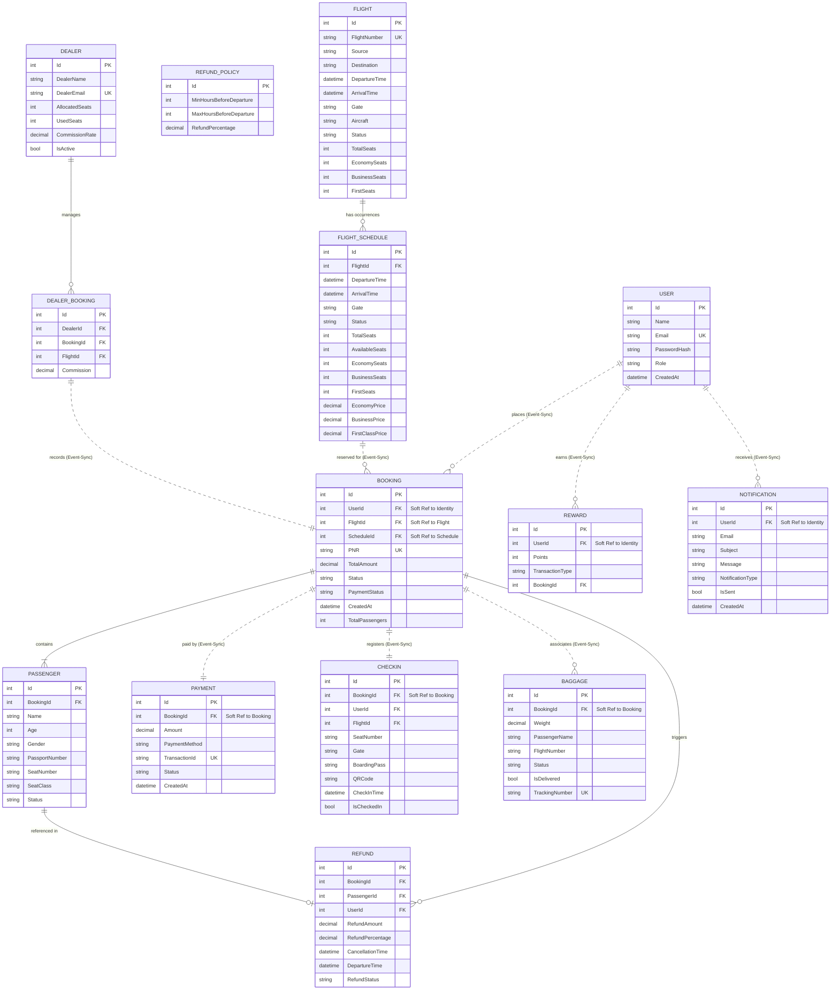

# Airline Management System - Professional ER Diagram

This document provide a comprehensive overview of the data architecture for the Airline Management System. In this microservices ecosystem, data is partitioned across multiple service-specific databases. Relationships between services are maintained conceptually via **Soft References** (IDs) and synchronized through **Event-Driven Communication** (RabbitMQ).

## Entity Relationship Diagram

## Architectural Notes

### 🧩 Service Isolation
Each block in the diagram represents a distinct database schema managed by its respective microservice. Data integrity across these boundaries is **eventual**, maintained by the SAGA pattern and RabbitMQ integration.

### 🔄 Event-Driven State
- **Payment Success**: Updates `Booking.Status` and `Booking.PaymentStatus`.
- **Flight Delay**: Triggers `Notification` creation.
- **Cancellation**: Triggers `Refund` calculation and `FlightSchedule.AvailableSeats` update.

### 🔑 Key Legends
- **PK**: Primary Key
- **FK**: Foreign Key
- **UK**: Unique Key
- **Solid Line (-)**: Strong relationship within the same database.
- **Dotted Line (..)**: Conceptual relationship across different microservices.
