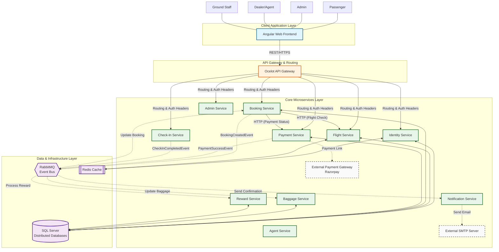

# Airline Management System - High-Level Design (HLD)

This document provides a professional visualization of the system's architecture, illustrating how different layers and components interact to provide a scalable and robust airline management ecosystem.

## High-Level Architecture Diagram

## Architectural Highlights

### 🎨 1. Decoupled Presentation
The **Angular Frontend** is entirely decoupled from the backend logic. It communicates solely through the **Ocelot API Gateway**, which abstracts the complex microservices grid behind a single URL.

### 🛡️ 2. Centralized Gateway (Ocelot)
- **Aggregated Routing**: Maps frontend paths (e.g., `/flights`) to internal service endpoints.
- **Security**: The gateway (and services) verify JWT tokens generated by the **Identity Service**.
- **Request Tracing**: Implements Correlation IDs (tracked via `CorrelationHttpHandler`) across service boundaries.

### 🔄 3. Event-Driven Communication (Choreography)
The system leverages **RabbitMQ** to avoid tight coupling between services. 
- **Example**: When a user books a flight, the `BookingService` doesn't wait for rewards to be added or emails to be sent. It publishes a `BookingCreatedEvent`, and the `RewardService` and `NotificationService` consume this asynchronously.

### ⚡ 4. Distributed Caching & Persistence
- **Redis Cache**: Used by the `IdentityService` for token blacklisting and `FlightService` for caching search results to reduce SQL load during peak search times.
- **SQL Server**: Each microservice manages its own schema, ensuring database isolation. Conceptual relationships (like `Booking.UserId`) are managed via service-to-service IDs rather than physical foreign keys.

### 🌐 5. Reliability Patterns
- **Retry & Circuit Breaker**: Services use **Polly** (via `Shared.Handlers`) for resilient HTTP communication during inter-service calls.
- **Saga Pattern**: Orchestrated via RabbitMQ to handle distributed transactions (e.g., if payment fails after seats are reserved, seats are released via compensation events).
