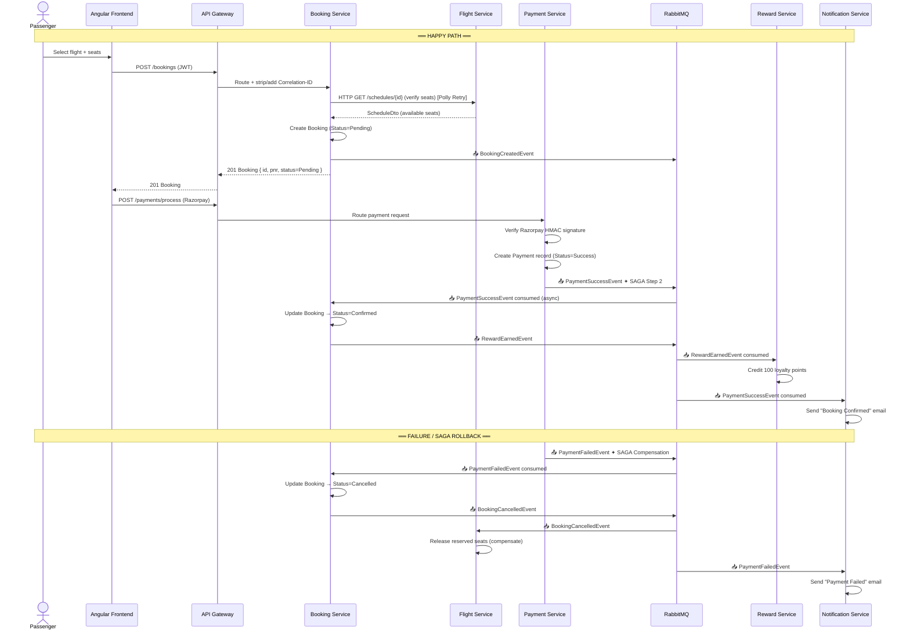
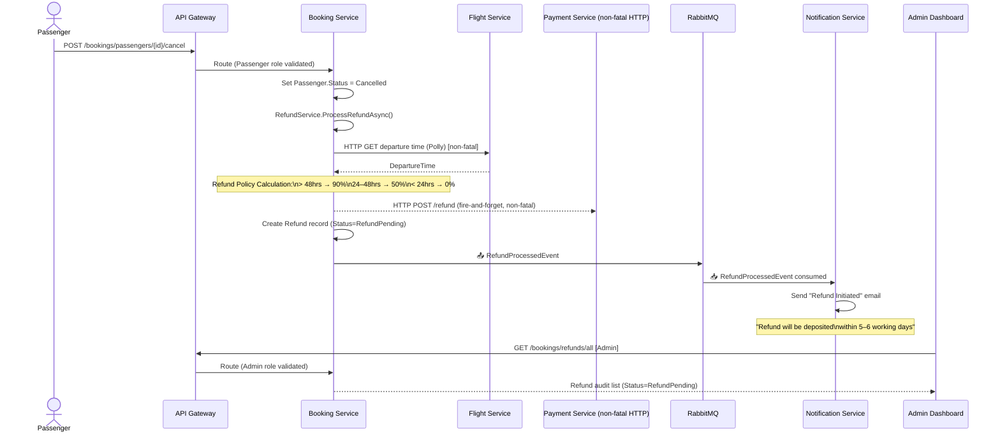

# Airline Management System — Low-Level Design (LLD)

> **Version**: Production v1.0  
> **Architecture**: Microservices · CQRS · Event-Driven (Choreography + SAGA)  
> **Runtime**: .NET 10 · Angular · Docker Compose  

---

## Diagram 1 — Full System LLD (Top-Down Flow)

```mermaid
flowchart TD
    %% ================================================================
    %% LAYER 0 — CLIENTS
    %% ================================================================
    subgraph CLIENTS ["① CLIENT LAYER"]
        direction LR
        P["👤 Passenger\n(Browser / Mobile)"]
        ADM["👤 Admin\n(Browser)"]
        DLR["👤 Dealer / Agent\n(Browser)"]
        GS["👤 Ground Staff\n(Browser)"]
    end

    %% ================================================================
    %% LAYER 1 — FRONTEND
    %% ================================================================
    subgraph FRONTEND ["② ANGULAR FRONTEND  •  Port 4200  •  Docker: frontend"]
        direction LR
        FE_CORE["Angular 17 SPA\n─────────────\nAuthGuard │ RoleGuard\nJWT Interceptor\nCorrelation-ID Interceptor\n─────────────\nModules:\n• BookingModule\n• FlightModule\n• AdminModule\n• RewardModule\n• CheckInModule\n• BaggageModule\n• AgentModule"]
    end

    %% ================================================================
    %% LAYER 2 — API GATEWAY
    %% ================================================================
    subgraph GATEWAY ["③ API GATEWAY  •  Port 5000  •  Docker: api-gateway"]
        GW_OCELOT["Ocelot API Gateway\n─────────────────────\n• JWT Validation (all routes)\n• Route Mapping:\n  /identity/*  → :5001\n  /flights/*   → :5002\n  /bookings/*  → :5003\n  /payments/*  → :5004\n  /checkins/*  → :5005\n  /baggages/*  → :5006\n  /rewards/*   → :5007\n  /agents/*    → :5008\n  /notify/*    → :5009\n  /admin/*     → :5010\n─────────────────────\nCorrelation-ID Header Pass-Through\nSwagger Aggregation"]
    end

    %% ================================================================
    %% LAYER 3 — MICROSERVICES
    %% ================================================================

    subgraph SVC_IDENTITY ["④-A IDENTITY SERVICE  •  Port 5001  •  Docker: identity-service"]
        direction TB
        ID_CTRL["AuthController\n────────────\nPOST /register\nPOST /login\nGET  /user/{id}"]
        ID_SVC["AuthService\n────────────\nRegister()\nAuthenticate()\nResetPassword()\nBlacklistToken()"]
        ID_REPO["UserRepository\n────────────\nIUserRepository\nEF Core CRUD"]
        ID_DB[("IdentityDb\nSQL Server")]
        ID_JWT["JwtTokenService\n────────────\nSign / Validate\nHS256 Token\nExp: 60 min"]
        ID_REDIS["Redis\n────────────\nToken Blacklist\nSession Cache"]
        ID_CTRL --> ID_SVC --> ID_REPO --> ID_DB
        ID_SVC --> ID_JWT
        ID_SVC --> ID_REDIS
    end

    subgraph SVC_FLIGHT ["④-B FLIGHT SERVICE  •  Port 5002  •  Docker: flight-service"]
        direction TB
        FL_CTRL["FlightsController\n────────────\nGET    /flights\nPOST   /flights\nPUT    /flights/{id}\nDELETE /flights/{id}\nPOST   /flights/{id}/delay\nPOST   /flights/{id}/cancel\nGET    /flights/schedules/{id}\nPOST   /flights/schedules"]
        FL_SVC["FlightService\nFlightScheduleService\n────────────\nSearch / CRUD\nSeat allocation\nSchedule completion"]
        FL_REPO["FlightRepository\n────────────\nIFlightRepository\nEF Core + Redis cache"]
        FL_WORKER["ScheduleCompletionWorker\n(IHostedService)\n────────────\nAuto-marks completed\nschedules every 5 min"]
        FL_REDIS["Redis\n────────────\nFlight Search Cache\nSchedule Cache"]
        FL_DB[("FlightDb\nSQL Server\n─────────\nFlights\nFlightSchedules")]
        FL_CTRL --> FL_SVC --> FL_REPO --> FL_DB
        FL_SVC --> FL_REDIS
        FL_WORKER --> FL_SVC
    end

    subgraph SVC_BOOKING ["④-C BOOKING SERVICE  •  Port 5003  •  Docker: booking-service"]
        direction TB
        BK_CTRL["BookingsController\n────────────\nPOST   /bookings\nGET    /bookings/{id}\nGET    /bookings/history/{userId}\nGET    /bookings/pnr/{pnr}\nPOST   /bookings/{id}/cancel\nPOST   /bookings/{id}/passengers\nGET    /bookings/{id}/passengers\nPOST   /bookings/passengers/{id}/cancel\nPOST   /bookings/{id}/passengers/cancel\nGET    /bookings/occupied-seats\nGET    /bookings/all  [Admin]\nGET    /bookings/refunds/all  [Admin]"]

        subgraph BK_CQRS ["CQRS Layer"]
            direction LR
            BK_CMD["COMMANDS\n────────────\nCreateBookingCommand\nCancelBookingCommand\nCancelPassengerCommand\nCancelMultiplePassengersCommand\nCreatePassengerCommand\nHandlePaymentSuccessCommand\nHandlePaymentFailedCommand"]
            BK_QRY["QUERIES\n────────────\nGetBookingByIdQuery\nGetBookingByPnrQuery\nGetBookingHistoryQuery\nGetBookingsByScheduleQuery\nGetOccupiedSeatsQuery\nGetPassengersForBookingQuery\nGetRefundsQuery"]
            BK_HDL["HANDLERS\n────────────\nCreateBookingCommandHandler\nCancelBookingCommandHandler\nCancelPassengerCommandHandler\nCancelMultiplePassengersCommandHandler\nHandlePaymentSuccessCommandHandler ✦\nHandlePaymentFailedCommandHandler"]
        end

        BK_SVC["BookingService (IBookingService)\nPassengerService (IPassengerService)\nRefundService (IRefundService)\n────────────\nFlight verification (HTTP + Polly)\nSeat calculation\nPNR generation\nRefund % calculation"]
        BK_REPO["IBookingRepository\nIPassengerRepository\n────────────\nEF Core CRUD\nBookingDbContext"]
        BK_DB[("BookingDb\nSQL Server\n─────────\nBookings\nPassengers\nRefunds\nRefundPolicies")]

        BK_CTRL --> BK_CQRS
        BK_CQRS --> BK_SVC
        BK_SVC --> BK_REPO --> BK_DB
    end

    subgraph SVC_PAYMENT ["④-D PAYMENT SERVICE  •  Port 5004  •  Docker: payment-service"]
        direction TB
        PY_CTRL["PaymentsController\n────────────\nPOST /payments/process\nGET  /payments/{id}\nPOST /payments/refund\nPOST /payments/razorpay/verify"]
        PY_SVC["PaymentService\n────────────\nInitiate Razorpay order\nVerify HMAC signature\nProcess refund\nUpdate payment status"]
        PY_REPO["PaymentRepository\n────────────\nIPaymentRepository\nEF Core CRUD"]
        PY_DB[("PaymentDb\nSQL Server\n─────────\nPayments")]
        PY_EXT["Razorpay Gateway\n(External HTTPS)"]
        PY_CTRL --> PY_SVC --> PY_REPO --> PY_DB
        PY_SVC -. "Create Order\nVerify Sign" .-> PY_EXT
    end

    subgraph SVC_CHECKIN ["④-E CHECK-IN SERVICE  •  Port 5005  •  Docker: checkin-service"]
        direction TB
        CH_CTRL["CheckInsController\n────────────\nPOST /checkins/online\nGET  /checkins/{id}\nGET  /checkins/{id}/boarding-pass"]
        CH_SVC["CheckInService\n────────────\nValidate booking\nAssign seat\nGenerate boarding pass\nGenerate QRCode"]
        CH_REPO["CheckInRepository\n────────────\nEF Core CRUD"]
        CH_DB[("CheckInDb\nSQL Server\n─────────\nCheckIns")]
        CH_CTRL --> CH_SVC --> CH_REPO --> CH_DB
    end

    subgraph SVC_BAGGAGE ["④-F BAGGAGE SERVICE  •  Port 5006  •  Docker: baggage-service"]
        direction TB
        BG_CTRL["BaggagesController\n────────────\nPOST /baggages\nGET  /baggages/{id}\nPUT  /baggages/{id}/status\nPOST /baggages/{id}/deliver\nGET  /baggages/track/{trackingNumber}\nGET  /baggages/booking/{bookingId}"]
        BG_SVC["BaggageService\n────────────\nCheck-in baggage\nUpdate status lifecycle\nGenerate tracking number\nMark delivered"]
        BG_REPO["BaggageRepository\n────────────\nEF Core CRUD"]
        BG_DB[("BaggageDb\nSQL Server\n─────────\nBaggages")]
        BG_CTRL --> BG_SVC --> BG_REPO --> BG_DB
    end

    subgraph SVC_REWARD ["④-G REWARD SERVICE  •  Port 5007  •  Docker: reward-service"]
        direction TB
        RW_CTRL["RewardsController\n────────────\nGET  /rewards/{userId}/balance\nGET  /rewards/{userId}/history\nPOST /rewards/earn\nPOST /rewards/redeem"]
        RW_SVC["RewardService\n────────────\nCredit points on booking\nDebit points on redemption\nBalance inquiry"]
        RW_REPO["RewardRepository\n────────────\nEF Core CRUD"]
        RW_DB[("RewardDb\nSQL Server\n─────────\nRewards")]
        RW_CTRL --> RW_SVC --> RW_REPO --> RW_DB
    end

    subgraph SVC_AGENT ["④-H AGENT SERVICE  •  Port 5008  •  Docker: agent-service"]
        direction TB
        AG_CTRL["AgentsController\n────────────\nPOST /agents/dealer\nGET  /agents/dealer/{id}\nGET  /agents/dealers\nPOST /agents/dealer/{id}/allocate-seats\nPOST /agents/booking/record\nGET  /agents/commission-report"]
        AG_SVC["AgentService\n────────────\nDealer CRUD\nSeat allocation tracking\nCommission calculation\nDealer booking recording"]
        AG_REPO["IDealerRepository\nIDealerBookingRepository\n────────────\nEF Core CRUD"]
        AG_DB[("AgentDb\nSQL Server\n─────────\nDealers\nDealerBookings")]
        AG_CTRL --> AG_SVC --> AG_REPO --> AG_DB
    end

    subgraph SVC_NOTIFY ["④-I NOTIFICATION SERVICE  •  Port 5009  •  Docker: notification-service"]
        direction TB
        NT_CTRL["NotificationsController\n────────────\nGET /notifications/{id}\nGET /notifications/user/{userId}"]
        NT_SVC["NotificationService\n────────────\nHandleBookingCreated()\nHandlePaymentSuccess()\nHandlePaymentFailed()\nHandleFlightDelayed()\nHandleCheckInCompleted()\nHandlePasswordReset()\nHandleRefundProcessed()"]
        NT_EMAIL["EmailService\n────────────\nSMTP / SendGrid\nHTML Templates\nAsync dispatch"]
        NT_REPO["NotificationRepository\n────────────\nEF Core CRUD"]
        NT_DB[("NotificationDb\nSQL Server\n─────────\nNotifications")]
        NT_CTRL --> NT_SVC
        NT_SVC --> NT_EMAIL
        NT_SVC --> NT_REPO --> NT_DB
        NT_EMAIL -. "SMTP/TLS" .-> SMTP_EXT["📧 External SMTP"]
    end

    subgraph SVC_ADMIN ["④-J ADMIN SERVICE  •  Port 5010  •  Docker: admin-service"]
        direction TB
        AD_CTRL["AdminController\n────────────\nGET /admin/dashboard\nGET /admin/booking-report\nGET /admin/revenue-report\nGET /admin/refund-audit"]
        AD_SVC["AdminService\n────────────\nAggregate data via\nHTTP calls to other\nservices (read-only)\nNo own database"]
        AD_CTRL --> AD_SVC
    end

    %% ================================================================
    %% LAYER 4 — MESSAGE BUS
    %% ================================================================
    subgraph MSG_BUS ["⑤ RABBITMQ EVENT BUS  •  Port 5672  •  Docker: rabbitmq"]
        direction LR
        MQ["RabbitMQ 3-Management\n─────────────────────────────────────────\nExchanges (Topic / Direct):\n  booking.events  │  payment.events\n  checkin.events  │  reward.events\n  notification.events  │  refund.events\n─────────────────────────────────────────\nEvents Published:\n  BookingCreatedEvent\n  PaymentSuccessEvent  ✦ SAGA Compensation\n  PaymentFailedEvent   ✦ SAGA Rollback\n  BookingCancelledEvent\n  RefundProcessedEvent\n  CheckInCompletedEvent\n  BaggageCheckedEvent\n  RewardEarnedEvent\n  FlightDelayedEvent\n  PasswordResetRequestedEvent"]
    end

    %% ================================================================
    %% LAYER 5 — INFRASTRUCTURE
    %% ================================================================
    subgraph INFRA ["⑥ SHARED INFRASTRUCTURE"]
        direction LR
        SQL_SERVER[("🗄️ SQL Server 2022\nDocker: sqlserver\nPort 1434\n──────────────────\nIsolated per-service\ndatabase schemas")]
        REDIS_CACHE["⚡ Redis Cache\nDocker: redis\nPort 6379\n──────────────────\nFlight search cache\nToken blacklist"]
        POLLY["🔄 Polly Resilience\n(Shared Library)\n──────────────────\nRetry: 3 attempts\nExponential backoff\nCircuit Breaker: 30s\nTimeout: 10s\nApplied on:\nHTTP inter-service calls"]
        CORR_ID["🔗 Correlation ID\n(Shared Library)\n──────────────────\nCorrelationMiddleware\nCorrelationHttpHandler\nX-Correlation-ID header\nPropagated across ALL\nservice calls"]
        SWAGGER["📄 Swagger / OpenAPI\n──────────────────\nPer-service Swagger UI\nJWT Bearer definition\nAll services :port/swagger"]
    end

    %% ================================================================
    %% PRIMARY FLOW CONNECTIONS
    %% ================================================================

    %% Users → Frontend
    P & ADM & DLR & GS --> FE_CORE

    %% Frontend → Gateway
    FE_CORE -- "HTTPS\nJWT in header\nCorrelation-ID" --> GW_OCELOT

    %% Gateway → Services (REST / HTTP)
    GW_OCELOT -- "Route: /identity/*" --> SVC_IDENTITY
    GW_OCELOT -- "Route: /flights/*" --> SVC_FLIGHT
    GW_OCELOT -- "Route: /bookings/*" --> SVC_BOOKING
    GW_OCELOT -- "Route: /payments/*" --> SVC_PAYMENT
    GW_OCELOT -- "Route: /checkins/*" --> SVC_CHECKIN
    GW_OCELOT -- "Route: /baggages/*" --> SVC_BAGGAGE
    GW_OCELOT -- "Route: /rewards/*" --> SVC_REWARD
    GW_OCELOT -- "Route: /agents/*" --> SVC_AGENT
    GW_OCELOT -- "Route: /notify/*" --> SVC_NOTIFY
    GW_OCELOT -- "Route: /admin/*" --> SVC_ADMIN

    %% HTTP Inter-service (sync + Polly)
    BK_SVC -- "HTTP + Polly Retry\nVerify Flight/Schedule\nseat availability" --> SVC_FLIGHT
    BK_SVC -- "HTTP (non-fatal)\nNotify refund" --> SVC_PAYMENT
    AD_SVC -- "HTTP (read aggregate)" --> SVC_BOOKING
    AD_SVC -- "HTTP (read aggregate)" --> SVC_PAYMENT

    %% ================================================================
    %% EVENT-DRIVEN FLOWS (RabbitMQ - Async)
    %% ================================================================

    %% Booking events published
    BK_SVC -. "📤 BookingCreatedEvent" .-> MQ
    BK_SVC -. "📤 BookingCancelledEvent" .-> MQ

    %% Payment events
    PY_SVC -. "📤 PaymentSuccessEvent ✦\n    PaymentFailedEvent ✦" .-> MQ

    %% CheckIn event
    CH_SVC -. "📤 CheckInCompletedEvent" .-> MQ

    %% RefundService event
    BK_SVC -. "📤 RefundProcessedEvent" .-> MQ

    %% Flight event  
    FL_SVC -. "📤 FlightDelayedEvent" .-> MQ

    %% Consumers
    MQ -. "📥 PaymentSuccessEvent ✦\nConfirm booking\nPublish RewardEarnedEvent" .-> SVC_BOOKING
    MQ -. "📥 PaymentFailedEvent ✦\nSAGA Rollback:\nRelease seats, Cancel booking" .-> SVC_BOOKING
    MQ -. "📥 BookingCancelledEvent\nRelease schedule seats" .-> SVC_FLIGHT
    MQ -. "📥 RewardEarnedEvent\nCredit loyalty points" .-> SVC_REWARD
    MQ -. "📥 All Events\n(Notification fanout)" .-> SVC_NOTIFY

    %% Infrastructure shared connections
    SVC_IDENTITY & SVC_FLIGHT --> REDIS_CACHE
    SVC_IDENTITY & SVC_FLIGHT & SVC_BOOKING & SVC_PAYMENT & SVC_CHECKIN & SVC_BAGGAGE & SVC_REWARD & SVC_AGENT & SVC_NOTIFY --> SQL_SERVER
    BK_SVC & FL_SVC & PY_SVC --> POLLY
    GW_OCELOT & BK_SVC & FL_SVC & PY_SVC --> CORR_ID

    %% ================================================================
    %% STYLING
    %% ================================================================
    classDef clientStyle   fill:#DBEAFE,stroke:#1E40AF,stroke-width:2px,color:#1E3A8A
    classDef frontendStyle fill:#EDE9FE,stroke:#5B21B6,stroke-width:2px,color:#3B0764
    classDef gatewayStyle  fill:#FEF3C7,stroke:#D97706,stroke-width:2px,color:#78350F
    classDef svcCoreStyle  fill:#D1FAE5,stroke:#065F46,stroke-width:2px,color:#064E3B
    classDef svcProcStyle  fill:#DCFCE7,stroke:#16A34A,stroke-width:2px,color:#14532D
    classDef mqStyle       fill:#FCE7F3,stroke:#9D174D,stroke-width:2px,color:#831843
    classDef infraStyle    fill:#F1F5F9,stroke:#475569,stroke-width:2px,color:#1E293B
    classDef extStyle      fill:#FEF9C3,stroke:#CA8A04,stroke-width:2px,stroke-dasharray:6 3,color:#713F12

    class P,ADM,DLR,GS clientStyle
    class FE_CORE frontendStyle
    class GW_OCELOT gatewayStyle
    class ID_CTRL,ID_SVC,ID_REPO,ID_DB,ID_JWT,ID_REDIS svcCoreStyle
    class FL_CTRL,FL_SVC,FL_REPO,FL_DB,FL_WORKER,FL_REDIS svcCoreStyle
    class BK_CTRL,BK_CMD,BK_QRY,BK_HDL,BK_SVC,BK_REPO,BK_DB svcCoreStyle
    class PY_CTRL,PY_SVC,PY_REPO,PY_DB,PY_EXT svcProcStyle
    class CH_CTRL,CH_SVC,CH_REPO,CH_DB svcProcStyle
    class BG_CTRL,BG_SVC,BG_REPO,BG_DB svcProcStyle
    class RW_CTRL,RW_SVC,RW_REPO,RW_DB svcProcStyle
    class AG_CTRL,AG_SVC,AG_REPO,AG_DB svcProcStyle
    class NT_CTRL,NT_SVC,NT_EMAIL,NT_REPO,NT_DB svcProcStyle
    class AD_CTRL,AD_SVC svcProcStyle
    class MQ mqStyle
    class SQL_SERVER,REDIS_CACHE,POLLY,CORR_ID,SWAGGER infraStyle
    class SMTP_EXT extStyle
```

---

## Diagram 2 — SAGA Pattern Detail (Booking + Payment Flow)

---

## Diagram 3 — Cancellation & Refund Flow

---

## Architecture Reference Summary

| Layer | Technology | Pattern |
|---|---|---|
| Frontend | Angular 17 | Guards, Interceptors, JWT |
| API Gateway | Ocelot | JWT Validation, Routing, Correlation-ID |
| Identity | ASP.NET Core + EF | Repository, JWT (HS256), Redis blacklist |
| Flight | ASP.NET Core + EF | Repository, Redis cache, Background Worker |
| Booking | ASP.NET Core + EF | **CQRS (Commands + Queries + Handlers)**, SAGA |
| Payment | ASP.NET Core + EF | Repository, Razorpay integration |
| CheckIn | ASP.NET Core + EF | Repository, QRCode generation |
| Baggage | ASP.NET Core + EF | Repository, Status lifecycle |
| Reward | ASP.NET Core + EF | Event-driven credit (RabbitMQ consumer) |
| Agent | ASP.NET Core + EF | Repository, Commission calculation |
| Notification | ASP.NET Core + EF | Event fanout consumer, SMTP/Email |
| Admin | ASP.NET Core | HTTP aggregation (no own DB) |
| Messaging | RabbitMQ 3.x | Choreography-based SAGA |
| Persistence | SQL Server 2022 | Per-service isolated databases |
| Cache | Redis Alpine | Flight search, token blacklist |
| Resilience | Polly | Retry (3x), Circuit Breaker, Timeout |
| Tracing | Correlation-ID | Propagated via headers across services |
| Containers | Docker Compose | 13 containers, bridge network |
| Logging | Serilog | Structured logs, per-service log files |
