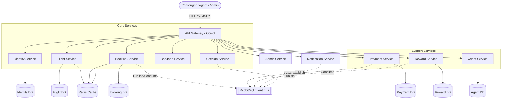
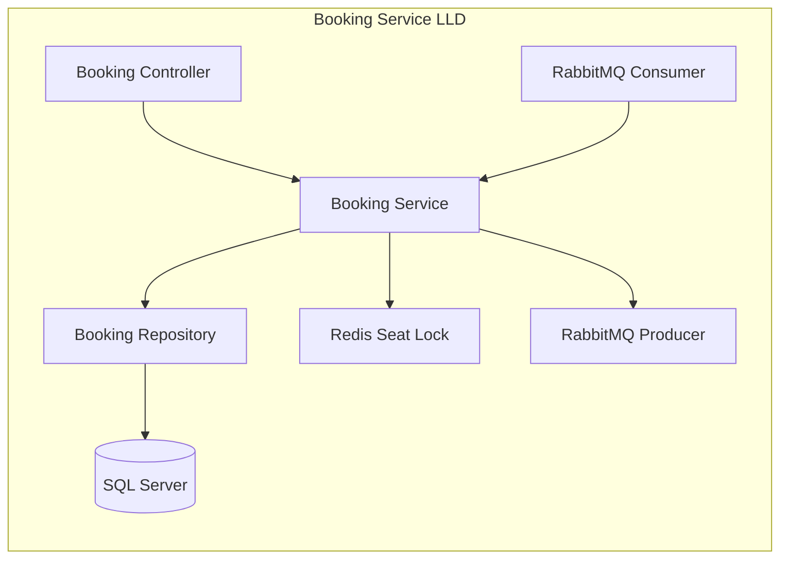
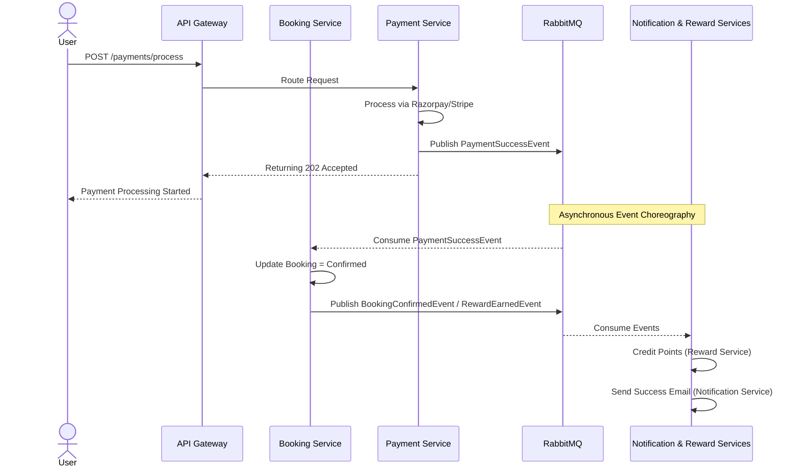
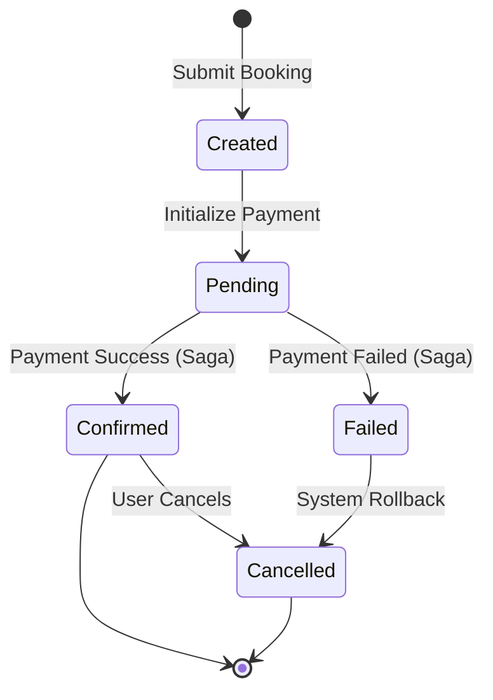
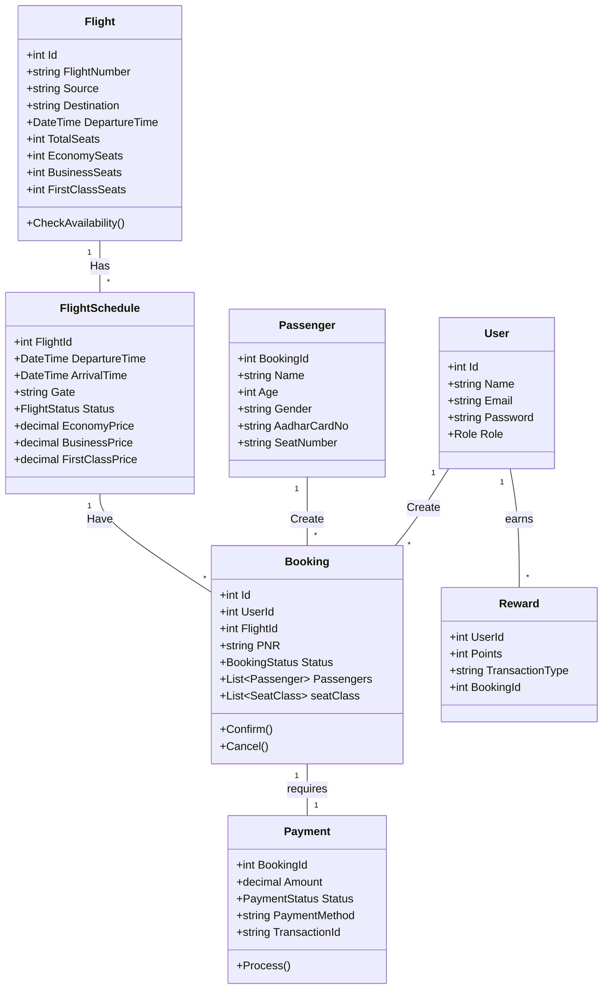
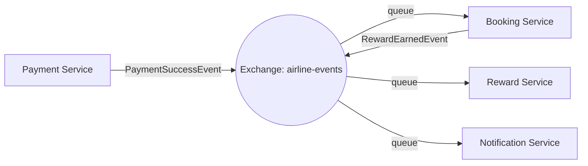
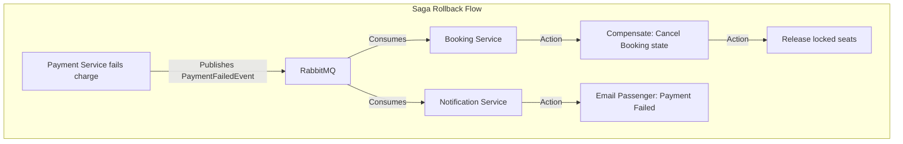
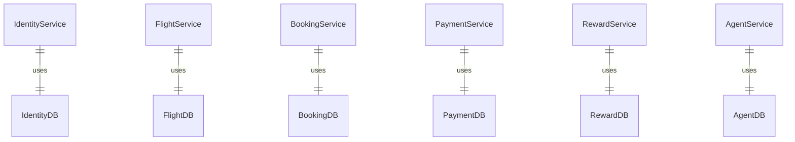

# Airline Management System - Architecture Documentation

## 1. HIGH LEVEL ARCHITECTURE (HLD)

The system is designed as a distributed, loosely coupled Microservices Architecture. It leverages an API Gateway pattern for external traffic routing, isolated databases per service to ensure bounded contexts, RabbitMQ for asynchronous event-driven choreography, and Redis for distributed caching and seat locking.

**Key Components:**
*   **API Gateway (Ocelot):** Routes external HTTP requests to internal microservices.
*   **Microservices:** Identity, Flight, Booking, Payment, Notification, Reward, Agent, Baggage, CheckIn.
*   **Message Broker (RabbitMQ):** Facilitates SAGA pattern (Choreography) and async background events.
*   **Cache Manager (Redis):** Seat Locks, and Search Caches.
*   **Database Engine (SQL Server):** Individual schema/database per microservice.



---

## 2. LOW LEVEL ARCHITECTURE (LLD)

Each microservice follows the typical Clean Architecture layered structure standard in .NET.

### Service Breakdown Example: Booking Service
*   **Controllers:** Handles HTTP REST endpoints (`POST /bookings`, `GET /bookings/{id}`).
*   **Services / Business Logic:** Implements seat validation, generates PNRs, coordinates with Redis.
*   **Repositories:** EF Core interactions for data persistence.
*   **Messaging:** Uses MassTransit for publishing `BookingCreatedEvent` and consuming `PaymentSuccessEvent`, `PaymentFailedEvent`.
*   **Redis Usage:** Accesses distributed locks for simultaneous seat bookings.



---

## 3. USE CASE DIAGRAM

Actors interacting with the digital touchpoints include the Passenger, Admin, Dealer/Agent, and Sub-Systems like the Payment Gateway.

```mermaid
usecase
    actor Passenger
    actor Admin
    actor Agent
    actor "Payment Gateway" as PG
    actor "Email System" as ES

    Passenger --> (Search Flight)
    Passenger --> (Book Flight)
    Passenger --> (Make Payment)
    Passenger --> (Online Check-in)
    Passenger --> (Cancel Booking)
    Passenger --> (Earn/Redeem Rewards)
    
    Agent --> (Dealer Login)
    Agent --> (Agent Booking)
    
    Admin --> (Manage Flights)
    Admin --> (View Reports)
    Admin --> (Allocate Agent Seats)

    (Make Payment) --> PG
    (Receive Email) <-- ES
    (Book Flight) .> (Receive Email) : include
    (Cancel Booking) .> (Receive Email) : include
```

---

## 4. ACTIVITY DIAGRAM

**Flight Booking Flow:** Describes the steps a user takes to successfully book a ticket, including asynchronous compensation steps.

```mermaid
activityDiagram
    start
    :User Searches Flight;
    if (Cache exists?) then (yes)
        :Fetch from Redis;
    else (no)
        :Fetch from FlightDB & Update Redis;
    endif
    :Select Flight & Class;
    :Acquire Seat Lock (Redis);
    if (Seat Available?) then (yes)
        :Enter Passenger Details;
        :Create Booking (Pending);
        :Proceed to Payment;
        if (Payment Success?) then (yes)
            :Publish PaymentSuccessEvent;
            :Update Booking to Confirmed;
            :Credit Reward Points;
            :Send Confirmation Email;
        else (no)
            :Publish PaymentFailedEvent;
            :Update Booking to Cancelled;
            :Release Seat Lock;
            :Send Failure Email;
        endif
    else (no)
        :Show "Seat Not Available" Error;
    endif
    stop
```

---

## 5. SEQUENCE DIAGRAM

Demonstrating the full Async Saga Pattern flow upon successful payment.



---

## 6. STATE DIAGRAM

Outlining the Lifecycle of a `Booking`.



---

## 7. CLASS DIAGRAM (PER MICROSERVICE)

*High-Level representation of primary domain entities per microservice.*



---

## 8. ENDPOINT ANALYSIS

Extracted endpoints directly from Controllers (`[HttpGet]`, `[HttpPost]`, etc.) across all services:

Total endpoints in project: **76**

| Microservice | Endpoints Count | Sample Key Routes |
|---|---|---|
| **Identity Service** | 9 | `POST /register`, `POST /login`, `GET /user/{id}` |
| **Flight Service** | 21 | `GET /search`, `POST /schedules`, `POST /{id}/delay` |
| **Booking Service** | 10 | `POST /`, `GET /{id}`, `POST /{id}/cancel`, `GET /pnr/{pnr}` |
| **Payment Service** | 5 | `POST /create-order`, `POST /process`, `POST /{id}/refund` |
| **CheckIn Service** | 4 | `POST /online`, `GET /{id}/boarding-pass` |
| **Baggage Service** | 8 | `POST /`, `PUT /{id}/status`, `GET /track/{trackingNumber}` |
| **Reward Service** | 4 | `POST /earn`, `POST /redeem`, `GET /{userId}/balance` |
| **Agent Service** | 8 | `POST /dealer`, `POST /booking/record`, `GET /commission-report` |
| **Notification Service**| 4 | `GET /{id}`, `GET /user/{userId}`, `PUT /mark-as-read/{id}` |
| **Admin Service** | 3 | `GET /dashboard`, `GET /booking-report`, `GET /revenue-report` |

---

## 9. RABBITMQ ANALYSIS

The system utilizes an asynchronous Event-Driven Architecture.

**Exchange Configuration:**
*   **Name:** `airline-events` (Topic Exchange)

**Event Queues Identified:**
*   `booking-created-queue`
*   `payment-success-queue`
*   `payment-failed-queue`
*   `booking-cancelled-queue`
*   `reward-earned-queue`
*   `checkin-completed-queue`
*   `notification-email-queue`

**Event Matrix:**
| Event | Publisher | Consumer(s) | Purpose |
|---|---|---|---|
| `PaymentSuccessEvent` | Payment Service | Booking, Notification | Confirms booking, alerts user |
| `PaymentFailedEvent` | Payment Service | Booking, Notification | Reverts booking state, alerts user |
| `RewardEarnedEvent` | Booking Service | Reward Service | Credits loyalty points |
| `BookingCancelledEvent` | Booking Service | Notification Service | Alerts user of cancellation |



---

## 10. SAGA PATTERN ANALYSIS

**Saga Type Detected:** **Choreography Saga**
The system uses decentralized choreography without a central orchestrator. Each service listens for specific state changes (events) and reacts by executing its local transaction and publishing a subsequent event.

*   **Orchestrator:** None (Decentralized workflow via EventBus).
*   **Primary Flow:** `Payment Processed` -> `Booking Reacts` -> `Reward Reacts`. 
*   **Rollback Strategy / Compensation:** 
    *   If payment fails, `PaymentFailedEvent` is thrown.
    *   `BookingService` catches this event, cancels the pending booking ticket, removes passenger allocations, and releases the seat. No rewards are given.



---

## 11. REDIS ANALYSIS

Redis is used to handle rapid concurrent reads and precise resource locking.

**Usage Locations:**
1.  **Flight Search Cache:** Prevents hammering the Flight DB on popular routes.
    *   *System:* Flight Service
    *   *TTL:* Defined Expiration
    *   *Key Pattern:* `flight_search:{Source}:{Destination}:{Date}` (Example: `flight_search:DEL:MUM:10-APR`)
2.  **Seat Lock (Concurrency Control):** Prevents double-booking race conditions when users select seats.
    *   *System:* Booking Service / Flight Service
    *   *TTL:* Temporary Lease
    *   *Key Pattern:* `seat_lock:flight_{id}:seat_{num}` (Example: `seat_lock:flight_123:seat_12`)
3.  **Idempotency & Rate Limiting:** Gateway tokens and duplicate transaction prevention.

---

## 12. EMAIL NOTIFICATION ANALYSIS

**Notification Triggers:**

| Email Type | Trigger Service | Trigger Event | Queue Used |
|---|---|---|---|
| **Booking Confirmed Email** | Payment Service | `PaymentSuccessEvent` | `payment-success-queue` |
| **Payment Failed Email** | Payment Service | `PaymentFailedEvent` | `payment-failed-queue` |
| **Booking Cancelled Email** | Booking Service | `BookingCancelledEvent`| `booking-cancelled-queue` |
| **Reward Credited Email** | Reward Service | `RewardEarnedEvent` | `reward-earned-queue` |

**Total Emails Types Count:** 4 core automated triggers + User Auth flows (Total: ~6).

---

## 13. SERVICE COMMUNICATION MATRIX

| From | To | Type | Sync/Async | Purpose |
|---|---|---|---|---|
| User / UI | Gateway | HTTP (`REST`) | Sync | API entry |
| Gateway | Booking | HTTP (`REST`) | Sync | Order creation |
| Gateway | Payment | HTTP (`REST`) | Sync | Payment initialization |
| Payment | Booking | RabbitMQ | Async | result / success notification |
| Booking | Reward | RabbitMQ | Async | Issue points after booking |
| Any Service | Notification| RabbitMQ | Async | Send event-based emails |

---

## 14. DATABASE PER SERVICE

Strict adherence to database-per-service pattern ensuring loose coupling.

*   `IdentityService` → **IdentityDB**
*   `FlightService` → **FlightDB**
*   `BookingService` → **BookingDB**
*   `PaymentService` → **PaymentDB**
*   `RewardService` → **RewardDB**
*   `AgentService` → **AgentDB**



---

## 15. FINAL SUMMARY

*   **Total Microservices:** 10
*   **Total Endpoints:** 76
*   **Total Queues:** 7 Primary Event Queues
*   **Total Exchanges:** 1 Main (`airline-events`), Topic Type
*   **Total Emails:** 4 Major Transactional Templates
*   **Redis Usage:** 4 Scenarios (Search Cache, Seat Lock, Rate Limit, Idempotency)
*   **Saga Type:** Choreography
