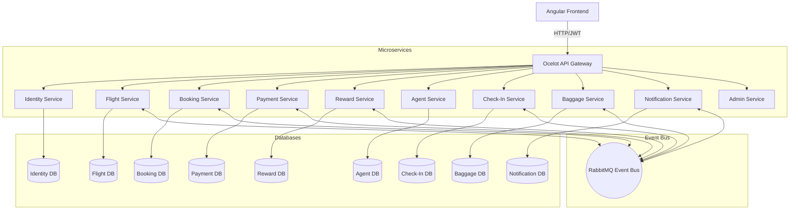
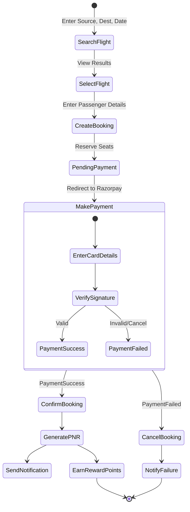
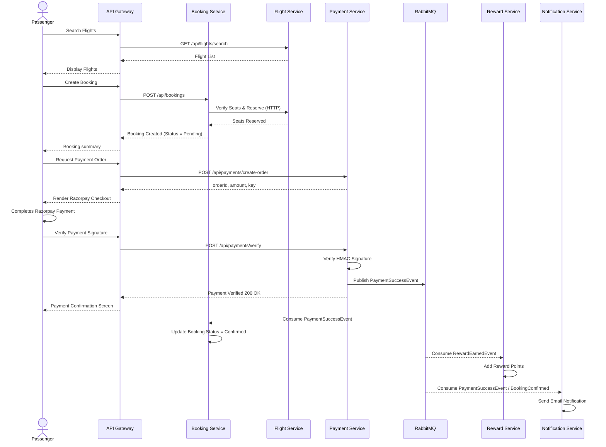
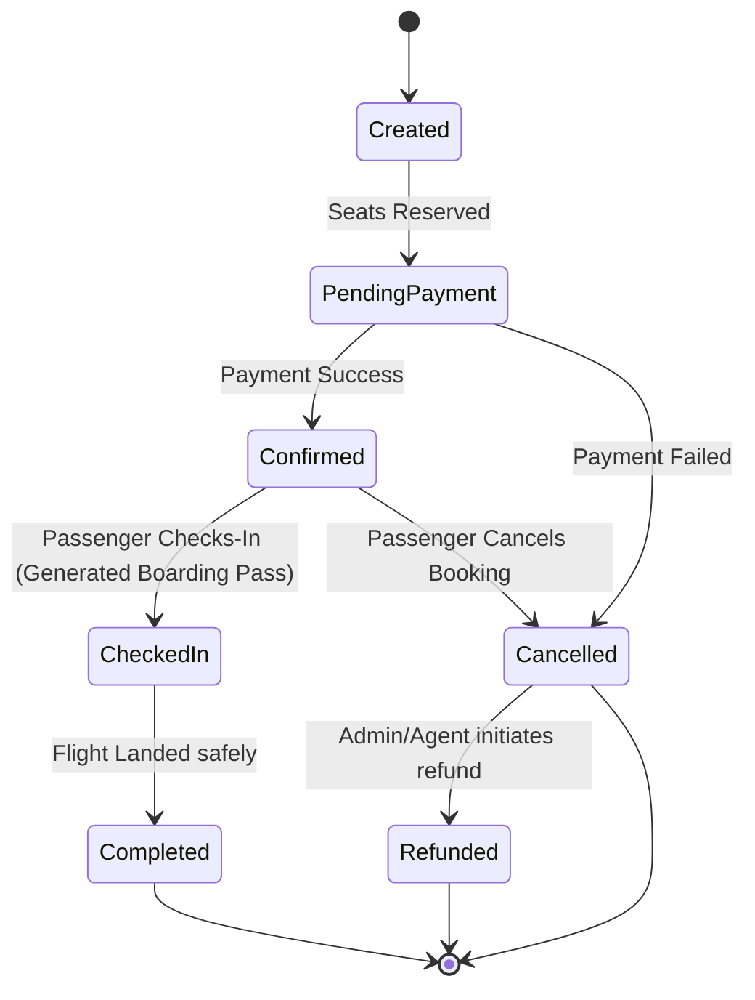
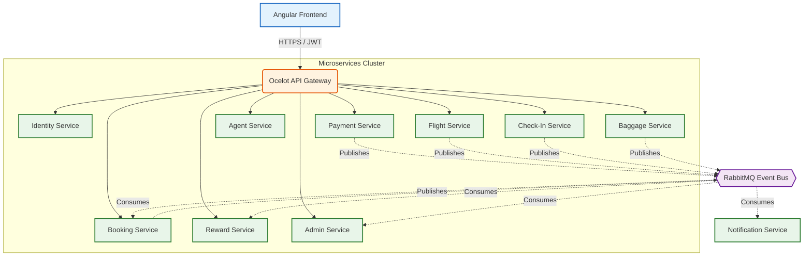

# Airline Management System - System Design Documentation

## 1. High Level Design (HLD)

The Airline Management System is built on a modern microservices architecture using .NET 10. It leverages Ocelot as the API Gateway for request routing and load balancing, RabbitMQ for asynchronous event-driven communication (Saga pattern), and separate SQL Server databases per service to ensure loose coupling and scalability. Angular serves as the frontend client.

### Authentication & Role-Based Access
- **Authentication Flow**: The user authenticates against the Identity Service. A JWT (JSON Web Token) is generated and returned to the client. The client passes this token in the `Authorization: Bearer <token>` header for all subsequent API Gateway requests.
- **Role-Based Access**: The system supports 4 primary roles: `Passenger`, `Admin`, `Dealer` (Agent), and `GroundStaff`.

### HLD Architecture Diagram

## 2. Low Level Design (LLD)

### Identity Service
- **Controllers**: AuthController (Login, Register, GetProfile)
- **Models**: User (Id, Name, Email, PasswordHash, Role)
- **Flow**: Validates credentials, issues JWT containing Role and UserId claims.

### Flight Service
- **Models**: Flight (FlightNumber, Source, Destination, DepartureTime, ArrivalTime, Seats, Pricing)
- **Logic**: Manages flight schedules, searches flights based on source/dest/date, manages available seats across Economy/Business/First classes.

### Booking Service
- **Models**: Booking (UserId, FlightId, PNR, Status, SeatClass, Passengers)
- **Logic**: Generates unique PNR, calculates total passengers, reserves seats via API call to Flight Service, manages booking status.

### Payment Service
- **Models**: Payment (BookingId, Amount, Status, TransactionId)
- **Logic**: Integrates with Razorpay. Creates order, verifies HMAC signature, publishes `PaymentSuccessEvent` or `PaymentFailedEvent`.

### Reward Service
- **Models**: Reward (UserId, Points, TransactionType)
- **Logic**: Listens to `RewardEarnedEvent` from RabbitMQ. Calculates points earned, manages points redemption during booking.

### Check-In Service
- **Models**: CheckIn (BookingId, SeatNumber, BoardingPass, CheckInTime)
- **Logic**: Allows seat selection 24 hours before departure, generates Boarding Pass and QR Code, publishes `CheckInCompletedEvent`.

### Baggage Service
- **Models**: Baggage (BookingId, Weight, TrackingNumber, Status)
- **Logic**: Tracks luggage transition from Checked -> Loaded -> InTransit -> Delivered.

### Agent Service
- **Models**: Dealer (DealerName, CommissionRate), DealerBooking
- **Logic**: Allocates flight bulk seats to dealers, tracks dealer bookings, calculates and issues commission points.

### Notification Service
- **Models**: Notification (UserId, Email, Subject, Message)
- **Logic**: Pure consumer service. Listens to RabbitMQ events (BookingCreated, PaymentSuccess, FlightDelayed) and dispatches emails/alerts.

### Admin Service
- **Models**: AdminDashboard, RevenueReport
- **Logic**: Aggregates data from other services to generate reports on revenue, active flights, and system traffic.

## 3. Activity Diagram: Passenger Flight Booking Flow

## 4. Sequence Diagram: Flight Booking with Payment

## 5. State Diagram: Booking Lifecycle

## 6. Microservices Architecture Diagram

## 7. Database Design

| Microservice | Table Name | Key Columns |
|--------------|------------|-------------|
| **Identity Service** | `Users` | Id (PK), Name, Email, PasswordHash, Role, CreatedAt |
| **Flight Service** | `Flights` | Id (PK), FlightNumber, Source, Destination, DepartureTime, EconomySeats, Prices |
| **Booking Service** | `Bookings` | Id (PK), UserId, FlightId, PNR, Status, PaymentStatus, SeatClass |
| | `Passengers` | Id (PK), BookingId (FK), Name, Age, Gender, AadharNumber, Status |
| **Payment Service** | `Payments` | Id (PK), BookingId, Amount, Status, PaymentMethod, TransactionId |
| **Reward Service** | `Rewards` | Id (PK), UserId, Points, TransactionType, BookingId |
| **Agent Service** | `Dealers` | Id (PK), DealerName, AllocatedSeats, CommissionRate |
| | `DealerBookings` | Id (PK), DealerId (FK), BookingId |
| **Check-In Service** | `CheckIns` | Id (PK), BookingId, SeatNumber, Gate, BoardingPass |
| **Baggage Service**| `Baggages` | Id (PK), BookingId, Weight, Status, TrackingNumber |

## 8. Event Driven Flow (RabbitMQ)

The system relies on a Saga pattern via RabbitMQ for eventual consistency. The main events are:

1. `BookingCreatedEvent` (Published by Booking) -> Consumed by Notification (Sends email).
2. `PaymentSuccessEvent` (Published by Payment) -> Consumed by Booking (Marks booking Confirmed), Notification (Sends receipt).
3. `PaymentFailedEvent` (Published by Payment) -> Consumed by Booking (Marks booking Cancelled), Notification.
4. `RewardEarnedEvent` (Published by Booking during payment success logic) -> Consumed by Reward (Credits points).
5. `BookingCancelledEvent` (Published by Booking) -> Consumed by Flight (Frees up seats).
6. `FlightDelayedEvent` (Published by Flight) -> Consumed by Notification (Notifies passengers).
7. `CheckInCompletedEvent` (Published by CheckIn) -> Consumed by Notification (Sends Boarding Pass).

## 9. Role Based Flow

- **Passenger Flow**:
  - Registers/Logs in securely.
  - Searches for a flight and inputs passenger detail constraints.
  - Generates a Pending booking, redirected to the secure Payment Checkout interface.
  - Earns rewards upon transaction completion and check-in success. Needs luggage tracking details dynamically pulled from baggage DB.
  
- **Admin Flow**:
  - Secure login with Global privileges.
  - Interacts with Admin/Dashboard Service to view aggregated metrics (Revenue, Load factors, Total users).
  - Can cancel flights or delay them from the Dashboard (Triggering RabbitMQ wide alerts).
  - Handles payment refund management.

- **Dealer (Agent) Flow**:
  - Authorized access to bulk seat allocation logic.
  - Receives automatic commission distributions upon confirmed proxy-bookings.
  - Dashboards reflect commissions earned, seats remaining in their agent account.
  
- **Ground Staff Flow**:
  - Utilizes Check-In & Baggage Services.
  - Confirms physical reporting, assigns baggage specific tracking numbers, updates baggage status to `Loaded`.
